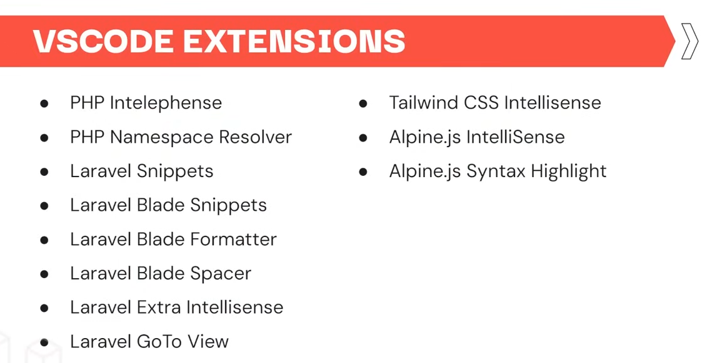

follow WPU laravel 11
https://www.youtube.com/playlist?list=PLFIM0718LjIW1Xb7cVj7LdAr32ATDQMdr

install Node.js
install composer

run using 
    php artisan serve
    npm run dev

using tailwind
    install guide
        npm install -D tailwindcss postcss autoprefixer
        npx tailwindcss init -p
    or follow https://tailwindcss.com/docs/guides/laravel

<!-- ////////////////////////////////////////////////////////////////////////// -->
make component using `php artisan make:component <NameComponent>` add `--view` when want make without class/controller

if add or edit some npm package, run `npm run build`
